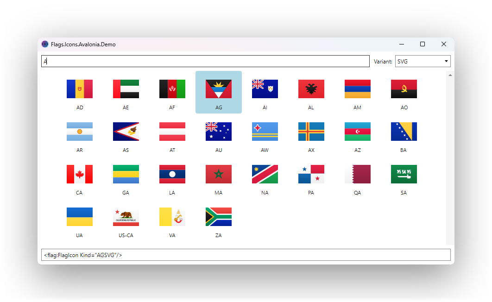

# Flags.Icons

<p align="center">
  <a href="https://www.nuget.org/packages/Flags.Icons"></a>
  <a href="https://www.nuget.org/packages/Flags.Icons.Avalonia"></a>
  <a href="https://www.nuget.org/packages/Flags.Icons.Eto"></a>
  <a href="https://www.nuget.org/packages/Flags.Icons.MAUI"></a>
  <a href="https://www.nuget.org/packages/Flags.Icons.MewUI"></a>
  <a href="https://www.nuget.org/packages/Flags.Icons.Uno"></a>
  <a href="https://www.nuget.org/packages/Flags.Icons.WinForms"></a>
  <a href="https://www.nuget.org/packages/Flags.Icons.WinUi"></a>
  <a href="https://www.nuget.org/packages/Flags.Icons.WPF"></a>
  <a href="https://github.com/Alpaq92/Flags.Icons/actions/workflows/ci.yml"></a>
  <a href="https://github.com/Alpaq92/Flags.Icons/actions/workflows/release.yml"></a>
  <a href="https://www.nuget.org/packages/Flags.Icons"></a>
  <a href="LICENSE"></a>
</p>

<p align="center">
  
</p>

Country flag icons from [madebybowtie/FlagKit](https://github.com/madebybowtie/FlagKit), packaged as drop-in controls for Avalonia, [Eto.Forms](https://github.com/picoe/Eto), .NET MAUI, [Aprillz.MewUI](https://github.com/aprillz/MewUI), Uno Platform, Windows Forms, WinUI 3 and WPF.

Every asset under `FlagKit/Assets/PNG` (`@1x`, `@2x`, `@3x`) and `FlagKit/Assets/SVG` is bundled directly into the **`Flags.Icons`** core NuGet as embedded resources — no runtime download, no file system access. **~1020 flag assets** (255 country/region codes × 3 PNG scales + SVG) are reachable through a single strongly-typed `FlagKind` enum that is **generated at build time** from the submodule's file list.

The platform-specific packages (`Flags.Icons.Avalonia`, `Flags.Icons.Eto`, `Flags.Icons.MAUI`, `Flags.Icons.MewUI`, `Flags.Icons.Uno`, `Flags.Icons.WinForms`, `Flags.Icons.WinUi`, `Flags.Icons.WPF`) are thin wrappers — they simply turn streams from the core library into their native image type and expose a `FlagIcon` control or fluent helper.

## Packages

| Package                  | Description                                                         | Target framework(s)                                                                                          |
|--------------------------|---------------------------------------------------------------------|--------------------------------------------------------------------------------------------------------------|
| `Flags.Icons`            | Core library: `FlagKind`, asset streams, resolver helpers           | `netstandard2.0`                                                                                             |
| `Flags.Icons.Avalonia`   | Avalonia `FlagIcon` templated control                               | `netstandard2.0`                                                                                             |
| `Flags.Icons.Eto`        | Eto.Forms `FlagIcon` control extending `ImageView` (SVG via Svg.Skia)                                              | `netstandard2.0`                                                                                             |
| `Flags.Icons.MAUI`       | .NET MAUI `FlagIcon` view (SVG via Svg.Skia)                        | `net10.0`, `net10.0-android`, `net10.0-ios`, `net10.0-maccatalyst` (+ `net10.0-windows10.0.19041.0` on Windows) |
| `Flags.Icons.MewUI`      | Aprillz.MewUI fluent helpers — `FlagIcon.Create(kind)` factory and `image.Flag(kind)` extension (SVG via Svg.Skia) | `net10.0`                                                                                                    |
| `Flags.Icons.Uno`        | Uno Platform `FlagIcon` control (`SvgImageSource` / `BitmapImage`)  | `net10.0`, `net10.0-browserwasm`, `net10.0-desktop` (+ `net10.0-windows10.0.26100` on Windows)               |
| `Flags.Icons.WinForms`   | Windows Forms `FlagIcon` control extending `PictureBox` (SVG via Svg.Skia) | `net8.0-windows`                                                                                       |
| `Flags.Icons.WinUi`      | WinUI 3 (Windows App SDK) `FlagIcon` control                        | `net8.0-windows10.0.19041.0`                                                                                 |
| `Flags.Icons.WPF`        | WPF `FlagIcon` control (SVG via SharpVectors)                       | `net8.0-windows`                                                                                             |

## Installation

Pick the package matching your UI stack — all of them transitively pull in `Flags.Icons` core:

```bash
dotnet add package Flags.Icons.Avalonia
# or
dotnet add package Flags.Icons.Eto
# or
dotnet add package Flags.Icons.MAUI
# or
dotnet add package Flags.Icons.MewUI
# or
dotnet add package Flags.Icons.Uno
# or
dotnet add package Flags.Icons.WinForms
# or
dotnet add package Flags.Icons.WinUi
# or
dotnet add package Flags.Icons.WPF
```

## Usage

The enum member encodes the country code, the scale (for PNGs), and the format. Hyphens in FlagKit file names become underscores in the enum (C# identifiers don't allow `-`).

| FlagKit file              | `FlagKind` member |
|---------------------------|-------------------|
| `Assets/PNG/US.png`       | `USPNG`           |
| `Assets/PNG/US@2x.png`    | `US2xPNG`         |
| `Assets/PNG/US@3x.png`    | `US3xPNG`         |
| `Assets/SVG/US.svg`       | `USSVG`           |
| `Assets/PNG/GB-ENG@2x.png`| `GB_ENG2xPNG`     |

### Avalonia

In `App.axaml`:

```xml
<Application ...>
  <Application.Styles>
    ...
    <StyleInclude Source="avares://Flags.Icons.Avalonia/App.xaml" />
  </Application.Styles>
</Application>
```

Then:

```xml
<Window xmlns:flag="clr-namespace:Flags.Icons.Avalonia;assembly=Flags.Icons.Avalonia">
    <flag:FlagIcon Kind="USSVG" Width="48" Height="36" />
    <Button Content="{flag:FlagIconExt FR2xPNG, 24}" />
</Window>
```

### Eto.Forms

Eto is also code-first; `FlagIcon` extends `ImageView`:

```csharp
using Eto.Drawing;
using Flags.Icons;
using Flags.Icons.Eto;

var flag = new FlagIcon { Kind = FlagKind.USSVG, Size = new Size(48, 36) };
```

### .NET MAUI

```xml
<ContentPage xmlns:flag="clr-namespace:Flags.Icons.Maui;assembly=Flags.Icons.MAUI">
    <flag:FlagIcon Kind="USSVG" WidthRequest="48" HeightRequest="36" />
</ContentPage>
```

### Aprillz.MewUI

MewUI is code-first (no XAML), so the package exposes a fluent helper rather than a `FlagIcon` control:

```csharp
using Aprillz.MewUI.Controls;
using Flags.Icons;
using Flags.Icons.MewUi;

var flag = FlagIcon.Create(FlagKind.USSVG, 48, 36);
// or, on an existing Image:
var img = new Image().Flag(FlagKind.FR2xPNG).Width(24).Height(18);
```

### Uno Platform

```xml
<Page xmlns:flag="using:Flags.Icons.Uno">
    <flag:FlagIcon Kind="USSVG" Width="48" Height="36" />
</Page>
```

### Windows Forms

`FlagIcon` extends `PictureBox`, so it works in the designer and in code-behind:

```csharp
using Flags.Icons;
using Flags.Icons.WinForms;

var flag = new FlagIcon { Kind = FlagKind.USSVG, Width = 48, Height = 36 };
Controls.Add(flag);
```

### WinUI 3

```xml
<Window xmlns:flag="using:Flags.Icons.WinUi">
    <flag:FlagIcon Kind="USSVG" Width="48" Height="36" />
</Window>
```

### WPF

```xml
<Window xmlns:flag="clr-namespace:Flags.Icons.WPF;assembly=Flags.Icons.WPF">
    <flag:FlagIcon Kind="USSVG" Width="48" Height="36" />
</Window>
```

### Discovering available kinds at runtime

```csharp
using Flags.Icons;

foreach (var kind in FlagIcons.AvailableKinds) {
    Console.WriteLine(kind);                    // "USSVG", "US2xPNG", ...
}

FlagInfo info = FlagKindResolver.GetInfo(FlagKind.USSVG)!;
// info.Code = "US", info.Format = FlagFormat.Svg, info.ResourceName = "assets/SVG/US.svg"

using Stream? raw = FlagAssetLoader.OpenStream(FlagKind.USSVG);
```

## Building from source

The PNG/SVG assets aren't checked into this repo directly — they live in [`madebybowtie/FlagKit`](https://github.com/madebybowtie/FlagKit), vendored as a git submodule at `FlagKit/`. The build embeds those files as manifest resources and code-generates `FlagKind.g.cs` from the file list before `CoreCompile`, so the submodule must be populated locally before the libraries (or demos) will compile with a non-empty `FlagKind` enum.

Clone with submodules in one shot:

```bash
git clone --recurse-submodules https://github.com/Alpaq92/Flags.Icons.git
```

Or, if you already cloned without:

```bash
git submodule update --init --recursive
```

To pull the latest upstream flag set on demand:

```bash
git submodule update --remote --merge FlagKit
```

**Inside Visual Studio**, every build of `Flags.Icons` runs that same `git submodule update --init --remote --merge FlagKit` automatically (defined in `build/Flags.Icons.FlagKit.targets`, gated on `BuildingInsideVisualStudio` so CI's `dotnet build` is unaffected). Newly-fetched files land in the same build — the asset globs and embedded-resource items are collected after the refresh, not at static project-evaluation time. The [`flagkit-refresh.yml`](.github/workflows/flagkit-refresh.yml) workflow runs the same refresh on a monthly cron and commits any movement as a `feat:` so release-please ships it on the next release.

If `FlagKit/Assets/{PNG,SVG}` is missing or empty, the generated enum will only contain `None = 0` and no flag resources will be embedded — that's the symptom of a submodule that hasn't been initialized.

## Demos

The repository ships one demo per UI stack. Each one renders **every** `FlagKind` in a centered, scrollable, wrapping grid with a search box (filter by country code, e.g. `US`, `DE`, `GB-ENG`), a variant picker (`PNG @1x/@2x/@3x` and `SVG`), and a click-to-copy snippet (XAML for the XAML stacks, C# for Eto/MewUI) so you can lift the markup straight into your project:

```bash
dotnet run --project Flags.Icons.Avalonia.Demo
dotnet run --project Flags.Icons.Eto.Demo                     # cross-platform (Win/Linux/macOS)
dotnet run --project Flags.Icons.MAUI.Demo                    # Windows or macCatalyst
dotnet run --project Flags.Icons.MewUI.Demo                   # cross-platform (Win/Linux/macOS)
dotnet run --project Flags.Icons.Uno.Demo                     # desktop only
dotnet run --project Flags.Icons.WinForms.Demo                # Windows only
dotnet run --project Flags.Icons.WinUi.Demo                   # Windows only (x64/ARM64)
dotnet run --project Flags.Icons.WPF.Demo                     # Windows only
```

The `Eto` and `MewUI` demos pick a platform host at build time via OS-conditional `<PackageReference>`s and select the matching backend at runtime — `Wpf` / `Win32 + Direct2D` on Windows, `Gtk` / `X11 + MewVG.X11` on Linux, `Mac64` / `MacOS + MewVG.MacOS` on macOS.

The shared `Flags.Demo.Shared` project (`netstandard2.0`, non-packable) holds the bits every demo needs — `FlagEntry`, `DemoVariant`, the `FlagCatalog` group-by-variant + search filter, and a `DemoViewModel` (INPC) that powers the five XAML demos. The eight per-platform demos consume it directly: the XAML demos subclass `DemoViewModel` (a one-liner; MAUI also wires an `ICommand`), and the imperative demos (WinForms, Eto, MewUI) call `FlagCatalog.Filter(variant, search)` from their rebuild loop.

## How it works

- `madebybowtie/FlagKit` is vendored as a git submodule at `FlagKit/`.
- The core `Flags.Icons` project's MSBuild (`build/Flags.Icons.FlagKit.targets`) embeds every PNG/SVG as a manifest resource named `assets/PNG/{filename}` or `assets/SVG/{filename}`, and code-generates `FlagKind.g.cs` from the file list before `CoreCompile` (one enum member per asset, plus `None = 0`).
- That same targets file also runs `git submodule update --init --remote --merge FlagKit` before each build **inside Visual Studio** (gated on `BuildingInsideVisualStudio` so CI's `dotnet build` is unaffected), so contributors don't have to remember to refresh the submodule manually. The [`flagkit-refresh.yml`](.github/workflows/flagkit-refresh.yml) workflow runs the same refresh on a monthly cron and commits any movement as a `feat:` so release-please ships it on the next release.
- `FlagAssetLoader.OpenStream(kind)` returns the raw bytes via `Assembly.GetManifestResourceStream`. Each platform-specific package consumes this:
  - **Avalonia** → `Bitmap` for PNG, `SvgImage` (via `Avalonia.Svg.Skia`) for SVG.
  - **Eto** → `Bitmap(byte[])` for PNG; SVG is rasterized to PNG at runtime via `Svg.Skia` (Eto has no SVG support).
  - **MAUI** → `ImageSource.FromStream` for PNG; SVG is rasterized to PNG at runtime via `Svg.Skia`.
  - **MewUI** → `ImageSource.FromBytes` for PNG; SVG is rasterized to PNG at runtime via `Svg.Skia` (MewUI ships no SVG decoder).
  - **Uno** / **WinUI** → `BitmapImage` for PNG, `SvgImageSource` for SVG.
  - **WinForms** → `Image.FromStream` for PNG; SVG is rasterized to PNG at runtime via `Svg.Skia` (Windows Forms has no SVG support).
  - **WPF** → `BitmapImage` for PNG, `DrawingImage` (via `SharpVectors`) for SVG.
- All shared NuGet metadata, SourceLink configuration, README/LICENSE/icon packaging, and SourceLink wiring lives in `Directory.Build.props` so every per-package csproj is short and focused.
- The demo apps share a single `build/icon.ico` — each demo links it via the platform's idiomatic mechanism (`AvaloniaResource`, `Resource` + `ApplicationIcon`, `ApplicationIcon`, or an embedded resource loaded at runtime via `IconSource.FromResource` / `Icon.FromResource`) so all the demo windows show the same icon.

## CI

Every PR and push to `main` runs the `CI` workflow, which builds the libraries and demos in parallel on three runners:

- **Linux** (`ubuntu-latest`) — core, Avalonia, Uno, MewUI (X11 + MewVG path), Eto (Gtk path).
- **Windows** (`windows-latest`) — WPF, WinForms, WinUI, MAUI, plus the Windows variants of MewUI (Win32 + Direct2D) and Eto (WPF).
- **macOS** (`macos-latest`) — core, Avalonia, Uno, MewUI (MacOS + MewVG path), Eto (Mac64 path).

This guarantees the OS-conditional `<PackageReference>` swaps in the MewUI/Eto demo csproj's actually compile on every OS we claim to support.

`ubuntu-latest` is the only Linux flavour GitHub-hosted runners offer, but that's fine here — the build output is IL plus RID-packed NuGet native bins, so what compiles on Ubuntu runs on any other glibc-based distro (Debian, Fedora, RHEL, …) without re-building. No multi-distro matrix is needed.

## Branch protection

`main` is protected by a single importable ruleset checked in at [`.github/rulesets/main-branch-protection.json`](.github/rulesets/main-branch-protection.json) (import via **Settings → Rules → Rulesets → Import a ruleset**). It enforces:

- **PR-only merges** — at least 1 approval, stale reviews dismissed on push, last-push approval required, all review threads must be resolved. Merge method: **squash** only (linear history is required, so merge commits would be blocked anyway).
- **Required status checks** — all three `CI` jobs (`Build core + Avalonia (linux)`, `Build WPF / MAUI (windows)`, `Build cross-platform demos (macos)`) must pass, and the branch must be up to date with `main` before merge (`strict_required_status_checks_policy: true`).
- **CodeQL** — the [`codeql.yml`](.github/workflows/codeql.yml) workflow scans the core + Linux-buildable wrappers (`csharp`, `security-and-quality` queries) on every PR plus a weekly cron. The `code_scanning` ruleset rule blocks merges on any high-or-higher security alert or any `error`-level finding.
- **Branch integrity** — no deletion, no force pushes, linear history required.
- **Bypass** — repo admins can bypass *only via PR*, never on direct push. On a solo repo with no other collaborators this is the path used to merge your own PRs once CI / CodeQL / threads are green, since the 1-approval requirement has no one else to satisfy it.

**Optional follow-ups (left off by default to avoid breaking unconfigured setups):**

- Re-add a `required_signatures` rule once contributors have commit signing set up (`git config commit.gpgsign true` + a configured GPG/SSH signing key).
- If you upgrade to Copilot Pro+ / Business / Enterprise (Copilot code review isn't available on the Free tier), add a `.github/CODEOWNERS` with `* @Copilot` and flip `require_code_owner_review` to `true` in the ruleset to make a Copilot approval mandatory on every PR.

## Release process

Versions and `CHANGELOG.md` are managed by [release-please](https://github.com/googleapis/release-please) driven by [Conventional Commits](https://www.conventionalcommits.org/). The `Release` workflow has two jobs:

1. **release-please** — on every push to `main`, opens (or updates) a Release PR that bumps `.release-please-manifest.json`, prepends a section to `CHANGELOG.md`, and lists the entries since the last tag. Merging that PR creates the matching `v*.*.*` tag and GitHub Release.
2. **publish** — runs in the same workflow immediately after a release is created (linked via `needs:`, so the GitHub-Actions limitation that `GITHUB_TOKEN`-created releases don't trigger downstream workflows doesn't apply). Packs all nine packages (`Flags.Icons`, `Flags.Icons.Avalonia`, `Flags.Icons.Eto`, `Flags.Icons.MAUI`, `Flags.Icons.MewUI`, `Flags.Icons.Uno`, `Flags.Icons.WinForms`, `Flags.Icons.WinUi`, `Flags.Icons.WPF`) at the new version and pushes them to NuGet.org (uses `secrets.NUGET_API_KEY`, idempotent via `--skip-duplicate`).

For a one-off republish of an existing tag, run the workflow via `workflow_dispatch` with an explicit `tag` input — release-please is skipped and the publish job runs against the supplied tag.

### Conventional Commits

Every commit on `main` must follow [Conventional Commits](https://www.conventionalcommits.org/). The mapping (configured in [`release-please-config.json`](release-please-config.json)):

| Prefix                                                                   | CHANGELOG section | Release effect (pre-1.0 / post-1.0) |
|--------------------------------------------------------------------------|-------------------|-------------------------------------|
| `feat:`                                                                  | Features          | patch / minor                       |
| `fix:`, `fix(deps):`                                                     | Bug Fixes         | patch / patch                       |
| `perf:`                                                                  | Performance       | patch / patch                       |
| `revert:`                                                                | Reverts           | patch / patch                       |
| `BREAKING CHANGE` (footer)                                               | top of section    | minor / major                       |
| `chore:`, `chore(deps):`, `docs:`, `refactor:`, `test:`, `build:`, `ci:` | (hidden)          | no release                          |

Pre-1.0 semantics (`bump-minor-pre-major` + `bump-patch-for-minor-pre-major` in the config) keep `feat:` from prematurely bumping minors and `BREAKING CHANGE` from jumping to 1.0 — once the project crosses `1.0.0`, the standard SemVer mapping kicks in.

### Automated commits

Two workflows commit directly to `main` using Conventional Commits, so release-please picks them up alongside human commits:

- **`flagkit-refresh.yml`** — monthly cron (`0 3 1 * *`) plus `workflow_dispatch`. Runs `git submodule update --remote --merge FlagKit`; if anything moved, commits as `feat: refresh FlagKit submodule to upstream tip`. Replaces the previous "release on every monthly cron" behaviour — quiet months with no upstream change now skip the release entirely.
- **`dependabot-auto-merge.yml`** + `dependabot.yml` — Dependabot's NuGet PRs use the `fix(deps):` prefix and auto-merge via squash, so the squashed commit inherits the prefix and lands as a `fix(deps):` on `main` (patch release). Actions-only bumps use `chore(deps):` (hidden, no release) since they don't affect anything shipped to NuGet.

### `RELEASE_PLEASE_PAT` (recommended)

`GITHUB_TOKEN` has two limitations that the release pipeline runs into:

1. **Pushes signed with `GITHUB_TOKEN` don't trigger downstream workflows.** So without configuration, both automated commit paths (FlagKit refresh and Dependabot auto-merge) land on `main` but don't wake `release.yml` — release-please's PR won't update until the next human push.
2. **`GITHUB_TOKEN` can't create PRs unless the repo opts in.** *Settings → Actions → General → Workflow permissions* has a checkbox **"Allow GitHub Actions to create and approve pull requests"** that defaults to off. While it's off, release-please fails with `GitHub Actions is not permitted to create or approve pull requests` even though the workflow has `pull-requests: write`.

A single fine-grained PAT solves both. Create one with `contents:write` + `pull-requests:write` on this repo and add it as a repository secret named `RELEASE_PLEASE_PAT`. All three workflows that need elevated permissions — [`release.yml`](.github/workflows/release.yml), [`flagkit-refresh.yml`](.github/workflows/flagkit-refresh.yml), and [`dependabot-auto-merge.yml`](.github/workflows/dependabot-auto-merge.yml) — use the pattern `${{ secrets.RELEASE_PLEASE_PAT || secrets.GITHUB_TOKEN }}`, so they fall back to `GITHUB_TOKEN` when the secret is unset and the rest of the pipeline (CI, manual pushes, release PR merges) keeps working without it.

If you'd rather not manage a PAT, the alternative for limitation #2 is checking the *"Allow GitHub Actions to create and approve pull requests"* repo setting — that unblocks release-please's PR creation but doesn't fix limitation #1 (automated commits still won't trigger downstream workflows). For a project with active Dependabot and monthly FlagKit refreshes, the PAT path is meaningfully better.

## License

The source code in this repository is licensed under the [MIT License](LICENSE).

The bundled PNG and SVG flag assets are **not** covered by the MIT license — they are vendored from [madebybowtie/FlagKit](https://github.com/madebybowtie/FlagKit) and retain its [MIT license](FlagKit/LICENSE).

The project icon (`icon.png`) is a separate third-party asset and is **not** covered by the MIT license — it is distributed under [CC BY-SA 4.0](https://creativecommons.org/licenses/by-sa/4.0/). See [Credits](#credits) for attribution.

## Development

Parts of this repository — including some of the per-platform `FlagIcon` wrappers, demo scaffolding, and CI/CD configuration — were developed with assistance from an audit-based AI workflow (each change reviewed and verified by a human maintainer before being merged). Bug reports and PRs are welcome.

## Credits

- **Flag assets** — every PNG and SVG is vendored from [madebybowtie/FlagKit](https://github.com/madebybowtie/FlagKit), licensed under MIT. Used unmodified.
- **Inspiration** — [Material.Icons.Avalonia](https://github.com/SKProCH/Material.Icons) by SKProCH. The templated-control + markup-extension pattern and the original demo layout are adapted from that project.
- **Icon** — from the [Jellyfin UX icon set](https://github.com/jellyfin/jellyfin-ux) by the [Jellyfin project](https://jellyfin.org/), licensed under [CC BY-SA 4.0](https://creativecommons.org/licenses/by-sa/4.0/). Used unmodified.
